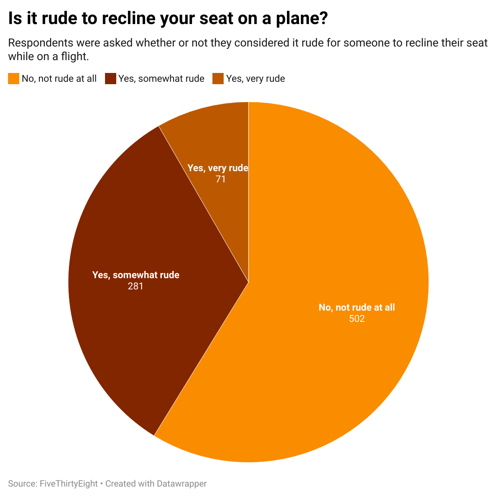

# j124-week4

I chose this question because I felt like there would be a fairly large disparity between the amount of people who chose each reponse. I figured most people would not consider it rude to recline your seat on a plane, and a much smaller proportion would consider it very rude. This made a pie chart a good choice for representing the data, since you can very clearly tell the difference between the sizes of each of the slices. Overall, the data more or less represents the expectations that I had about how people would respond to this question, and the chart shows that while most people agree that reclining your seat is not rude, many are somewhat bothered by it.

